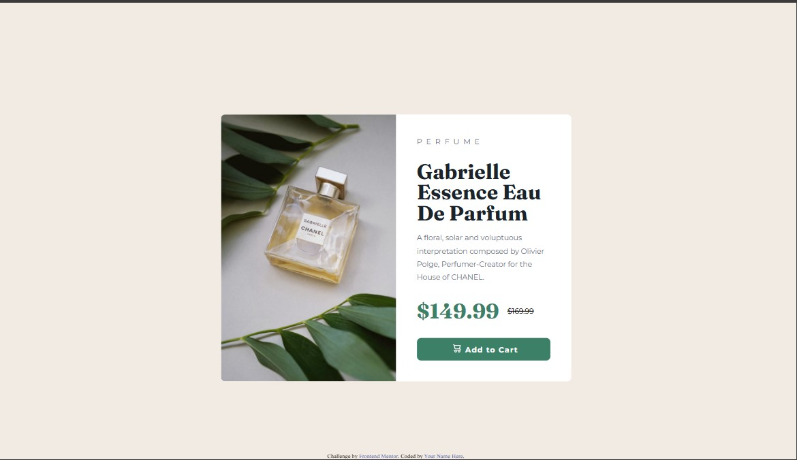

# Frontend Mentor - Product preview card component solution

This is a solution to the [Product preview card component challenge on Frontend Mentor](https://www.frontendmentor.io/challenges/product-preview-card-component-GO7UmttRfa). Frontend Mentor challenges help you improve your coding skills by building realistic projects.

## Table of contents

- [Overview](#overview)
  - [The challenge](#the-challenge)
  - [Screenshot](#screenshot)
  - [Links](#links)
- [My process](#my-process)
  - [Built with](#built-with)
  - [What I learned](#what-i-learned)
  - [Continued development](#continued-development)
  - [Useful resources](#useful-resources)
  - [AI Collaboration](#ai-collaboration)
- [Author](#author)
- [Acknowledgments](#acknowledgments)

## Overview

### The challenge

Users should be able to:

- View the optimal layout depending on their device's screen size
- See hover and focus states for interactive elements

### Screenshot



### Links

- Solution URL: [Add solution URL here](https://your-solution-url.com)
- Live Site URL: [Add live site URL here](https://your-live-site-url.com)

## My process

### Built with

- Semantic HTML5 markup
- CSS custom properties
- Flexbox
- CSS Grid
- Mobile-first workflow

### What I learned

I learnt about a new HTML tag that allows us to strike through text; also CSS can be used to control this behaviour.
On responsive images, I newly used the tag "max-inline-size" which works like max-width, keeping the image at it maximum size no matter the size of the page. "block-size" helps to keep the image sized according to its aspect ratio.

Above all, this project reinforced CSS positioning and box-model which is very interesting and beautiful.

This project is a takeaway reminder that there's is a wonderful solution to any problem. You just have to believe it exist. Conclusively, I am amazed with the more we can do with technology!

```html
<p class="old-price"><s>$169.99</s></p>
```

```css
.old-price {
  text-decoration: line-through;
}
```

### Continued development

I want to keep building my skills and getting more and more relevant and valuable in this world by making it ultimately better.

### Useful resources

- (https://web.dev/learn/design/responsive-images) - This helped me making images responsive.

### AI Collaboration

I used DeepSeek AI for brainstorming solutions and it did work well.

## Author

- Website - [Add your name here](https://www.your-site.com)
- Frontend Mentor - [@yThe-Queen-Builds](https://www.frontendmentor.io/profile/The-Queen-Builds)
- Twitter - [@EbimoboereLaye](https://www.twitter.com/EbimoboereLaye)

## Acknowledgments

I appreciate God almighty the giver of life. He is my rock and strength. This project thrived in my hands because of Him.
Also, I appreciate my lovely and strong dad who tells me to 'Go for the Gold'. He deserves all the love and respect in the world.
